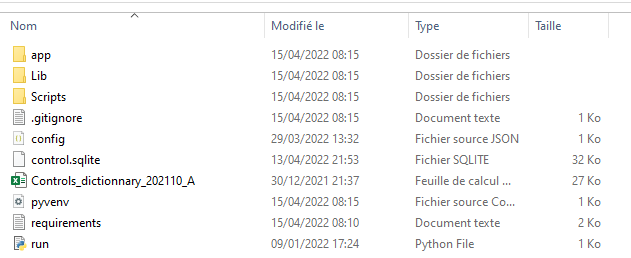
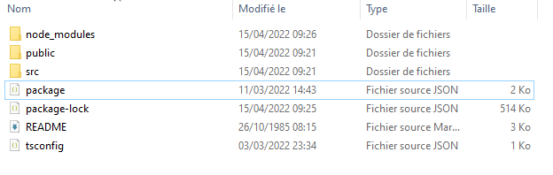

# BNP Search Engine

## 1 . Setting up the back

To work in a clean environment, it is better to create a new one either with conda or pip.

I prefer using pip for Web applications.

    pip install virtualenv
    virtualenv chatbot

Once the environment is created, put the files in the folder back in the folder environment. The environment folder should look like this after pasting the back files.

Then install the requirements using
    pip install -r requirements.txt

Then to start the back, just launch in cmd
    run.py

## 2. Setting up the front

Clone the front into a folder the run the following command

    npm install
    npm start

We used npm version: 6.14.15 and node version: v14.17.6.

To run the front with npm start.

